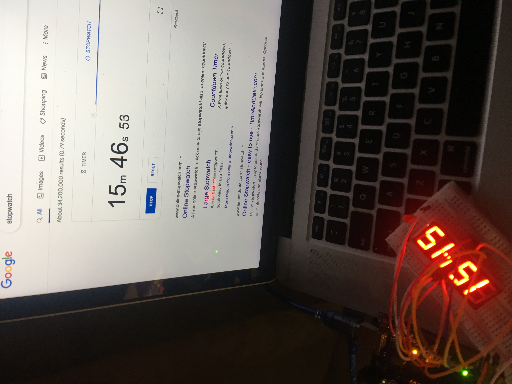
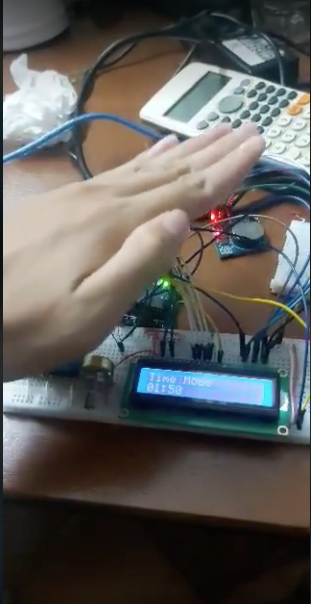

# AVR Digital Clock

### Table of Contents
* [Project Description](#description)
* [How to run?](#run) 
* [Credits](#credits)

# Project Description
- Final project for EEET2505 - Introduction to Embedded Systems
- Built and compiled on Microchip Studio (previously known as Atmel Studio)
- Deployed on Arduino UNO R3 (ATmega328P microcontroller)
- Full documentation can be found in the `docs` folder

**Version 1 - Basic Clock:** 
- Keeps track of time using ATmega328P's crystal oscillator; displays time using 7-segment
- Extra functionality: heat sensor. Alarm will go off if the temperature exceeds 40 C degree
- Ver 1 accuracy:

**Version 2 - Clock with Time Keeper:** 
- Keeps track of time using DS1302 RTC module; displays time on an LCD
- Extra functionality: light sensor. LCD's brightness will turn up if the surrouding light is dimmed, and turn down if the surrounding is bright
- Ver 2 with light sensor:

# How to run?
Choose a version you want to run. Compile either using Microchip Studio or Arduino IDE and upload to your Arduino board.

## Credits
[Binh Phan](https://github.com/bmo8699)

